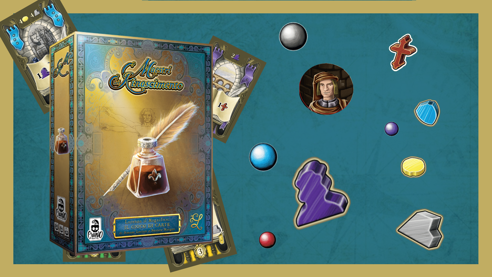

# Prova Finale di Ingegneria del Software - AA 2020-2021 : Masters of Renaissance

This project is the JAVA implemantation of the board game: [Masters of Renaissance](http://www.craniocreations.it/prodotto/masters-of-renaissance/).

## Documentation

### UML
These are the diagrams of the classes, the first one is the UML created at the beginning of the project, the last one is the final UML created at the end of the project. 

- [Initial UML](deliveries/UML/UML_Initial_Model.mdj)
- [Final UML](//Da aggiugere)

### JavaDoc
This is the documentation of most of the classes and methods implemented. You can consult it at:: [Javadoc](//Da aggiungere)

### Coverage report
Numerous tests have been performed using Junit, you can consult the coverage report at the following link:: [Report](//Da aggiungere)

### Plugins and Libraries
|Libreria/Plugin|
|---------------|
|__Maven__|
|__JUnit__|

## Implemented Functionalities
| Functionality | Status |
|:-----------------------|:------------------------------------:|
| Basic rules | |
| Complete rules | |
| Socket | |
| GUI |  |
| CLI | |
| Multiple games | |
| Persistence |  |
| Parameter editor |  |
| Local game |  |
| Resilience to disconnections | |
#### Legend
 Not Implemented &nbsp;&nbsp;&nbsp;&nbsp; Implemented

## Software

**StarUML** - UML diagrams and sequence diagrams

**Intellij IDEA Ultimate** - main IDE 

## Jars

The Jars of this project can be found here: [JARS] (//Da aggiungere)

### Execution of Jar

### Client
The following instructions describe how to successfully start the application in GUI and CLI.
Due to the limitations of the windows command line, it is necessary to use WSL in order to play in CLI mode with this operating system.

#### CLI
//Descrizione di come lanciare la CLI

#### GUI

//Descrizione di come lanciare la GUI

#### Server
//Descrizione di come lanciare il server

#### Parameters
//descrizione parametri

## Team members
- [__Fabio Chini__](https://github.com/chinifabio)
- [__Franscesco Colabene__](https://github.com/FrancescoColabene)
- [__Vincenzo Curreri__](https://github.com/Vinz-z)
